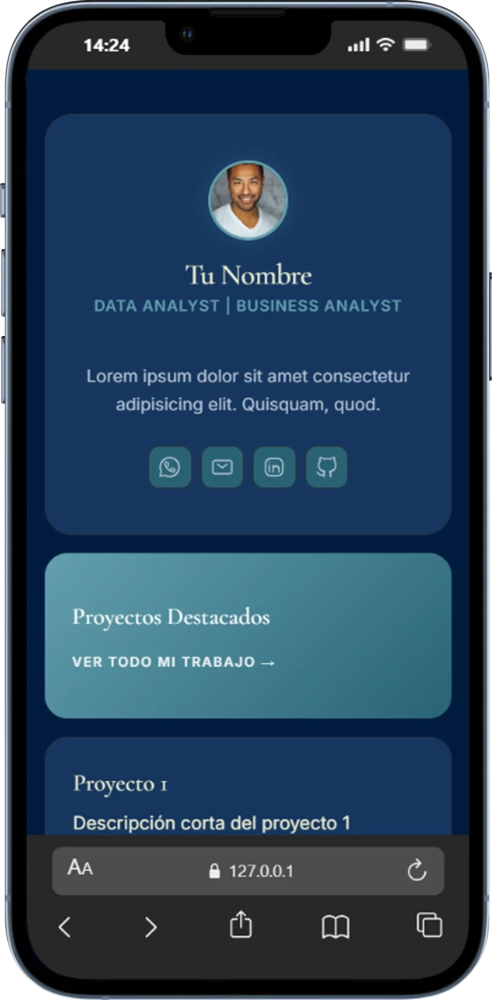
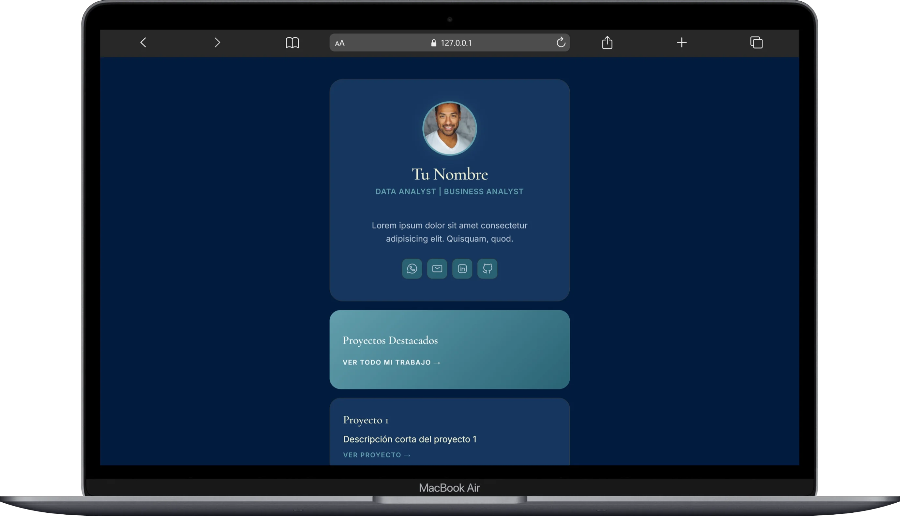

# Portfolio Minimalista

  
  

Esta es una plantilla de portafolio minimalista y fácil de implementar, diseñada para profesionales que buscan una alternativa elegante a Linktree.

## ✨ Características

- **Bento Grid**: Organización visual clara y moderna.
- **Responsive**: Optimizado para móviles y escritorio.
- **Sin Frameworks**: Hecho con HTML5 puro, CSS3 (variables y animaciones) y Vanilla JS.
- **Animaciones Premium**: Efectos de revelado y transiciones suaves.

## 🚀 Cómo usar

1. **Descarga**: Clona o descarga estos archivos (`index.html`, `data.json`, `styles.css`, `script.js`).
2. **Personaliza**:
   - **No toques el HTML**: Edita el archivo `data.json` para cambiar tu nombre, bio, redes sociales y links de proyectos.
   - El archivo `index.html` sirve como plantilla y cargará todo automáticamente.
3. **Estilo**: Si quieres cambiar los colores, solo ajusta los valores en la sección `:root` de `styles/styles.css`.
4. **Despliega**: Súbelo a GitHub Pages, Vercel o Netlify simplemente arrastrando la carpeta.

### ⚠️ Importante para previsualización local

Debido a políticas de seguridad de los navegadores, no puedes abrir el archivo `index.html` haciendo doble clic directamente si quieres que cargue el contenido desde el JSON.

**¿Cómo abrirlo correctamente?**

1. Abre la carpeta del proyecto en **VS Code**.
2. Instala la extensión **"Live Server"** (de Ritwick Dey).
3. Haz clic derecho en `index.html` y selecciona **"Open with Live Server"**.
4. ¡Listo! Tu portafolio se cargará dinámicamente.

## 🛠️ Estructura de Archivos

- `index.html`: Plantilla dinámica principal.
- `js/script.js`: Lógica de carga y renderizado.
- `js/mock-data/data.json`: Almacén central de datos (edita esto para cambiar el contenido).
- `styles/styles.css`: Sistema de diseño y estilos IT.

---

_Diseñado con ❤️ para profesionales._
